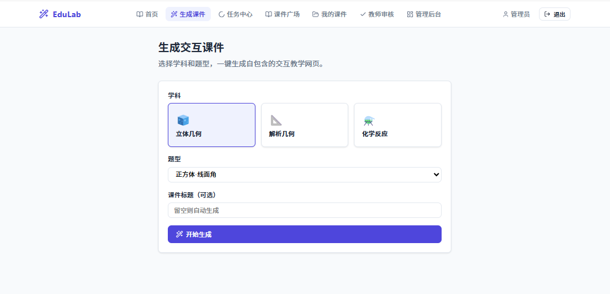

# EduLab 交互教学课件 Web 管理系统

基于 [wy51ai/edulab](https://github.com/wy51ai/edulab) 的三大交互教学技能（立体几何 / 解析几何 / 化学反应），一键生成带 Three.js/MathJax/KaTeX 的自包含课件，完美适配课堂大屏与低带宽环境。


> 将 edulab 三大技能封装为完整 Web 管理系统：用户通过浏览器提交参数生成课件，自动调度 Python worker 执行 sympy 计算 + HTML 渲染，支持任务队列、用户认证、课件管理、管理员审核。

### 演示截图（待补充）


**首页**：快速入口 + 学科选择



**生成中心**：选题型/参数 → 一键提交


**任务中心**：实时进度 + 取消/重试


**课件广场**：公开课件浏览 + iframe 预览


**管理后台**：用户/审核/统计/题型目录

### 演示视频

生成的课件是**自包含单页 HTML**（Three.js + MathJax/KaTeX 内联或 CDN），直接浏览器打开即可交互。


**推荐在线播放方式**：
1. 本地双击 `server/uploads/lessons/<lesson-id>/index.html`
2. 或通过 `/lessons/:id/view` 接口 iframe 嵌入

### 项目介绍

本项目将 edulab 三大交互技能封装为完整 Web 管理系统：
- 教师/学生通过浏览器提交参数生成课件
- 后台自动调度 Python worker 执行 sympy 计算 + HTML 渲染
- 支持任务队列、用户认证、课件管理、管理员审核

### 核心能力一览

- **立体几何**（Three.js 3D + MathJax）：正方体/长方体线面角、体积、随机出题（3D 可旋转 + 镜头切换）
- **解析几何**（Canvas 2D + KaTeX）：椭圆/双曲线/抛物线 6 种经典问题（参数滑块实时重算）
- **化学反应**（Three.js 3D + KaTeX）：甲烷/氢气/葡萄糖燃烧、电解水、氧化还原、酯化（3D 分子动画 + 原子守恒 + 机理关键帧）

### 技术栈

- 前端：React 19 + Vite 6 + TypeScript
- 后端：Express 4 + Node.js
- Worker：Node 调度 + Python/sympy 子进程（CPU 重负载单独进程）
- 数据库：MySQL 8（生产） / 内存 JSON（开发，零依赖）
- 部署：Docker + docker-compose

### 快速开始

#### 前置依赖
- Node.js 18+
- Python 3 + sympy（`pip3 install sympy`）

#### 开发模式
```bash
# 安装依赖
npm install
npm --prefix server install

# 启动后端 + Worker + 前端（三个进程并行）
npm run dev:all

# 或分别启动
npm run dev:server   # API on :3002
npm run dev:worker   # Worker
npm run dev          # Vite dev server on :3000
```

打开 http://localhost:3000

**演示管理员**：设置 `SEED_DEMO_ACCOUNTS=true` 并配置 `DEMO_ADMIN_PASSWORD`（至少 12 位）。

#### 生产构建
```bash
npm run build
NODE_ENV=production node server/index.js
```

#### Docker 部署
```bash
docker compose up -d --build
```

服务启动在 http://localhost:3002（API + 静态前端），MySQL 数据持久化到 Docker volume。

### 环境变量

复制 `.env.example` 为 `.env`：

| 变量                  | 默认值       | 说明                                      |
|-----------------------|--------------|-------------------------------------------|
| PORT                  | 3002        | API 端口                                  |
| USE_MYSQL             | false       | true 使用 MySQL，否则内存 JSON            |
| MYSQL_HOST            | localhost   | MySQL 主机                                |
| MYSQL_PORT            | 3306        | MySQL 端口                                |
| MYSQL_USER            | root        | MySQL 用户                                |
| MYSQL_PASSWORD        |             | MySQL 密码                                |
| MYSQL_DATABASE        | ai_teaching_edulab | 数据库名                             |
| PYTHON_BIN            | python3     | Python 解释器路径                         |
| WORKER_CONCURRENCY    | 1           | Worker 并发数（sympy 吃 CPU）             |
| PYTHON_TIMEOUT_MS     | 300000      | 单个 Python 生成任务超时                  |
| LESSON_ARTIFACTS_ROOT | ./server/uploads/lessons | 课件 HTML 输出目录 |
| SESSION_TTL_HOURS     | 168         | 会话过期时间                              |
| SEED_DEMO_ACCOUNTS    | false       | 启动时种子演示账号（内存模式）             |
| DEMO_ADMIN_PASSWORD   |             | 演示管理员密码                            |

### 项目结构

```
ai-teaching-edulab/
├── server/                          # Node + Express API
│   ├── index.js                    # 路由 + 中间件
│   ├── db.js                       # 数据层（MySQL + 内存双模式）
│   ├── loadEnv.js
│   ├── services/
│   │   ├── rbac.js                 # 角色权限
│   │   ├── skillCatalog.js         # 技能/题型目录
│   │   └── skillRunner.js          # Python 子进程封装
│   └── workers/
│       └── lessonWorker.js         # 任务调度 Worker
├── App.tsx                         # 前端主应用
├── types.ts                        # TypeScript 类型
├── styles.css
├── skills -> node_modules/@wy51ai/edulab/skills/  # 三大技能
├── Dockerfile
└── docker-compose.yml
```

### API 概览

| 方法 | 路径                          | 说明                              |
|------|-------------------------------|-----------------------------------|
| POST | `/api/auth/register`          | 注册                              |
| POST | `/api/auth/login`             | 登录                              |
| GET  | `/api/auth/me`                | 当前用户                          |
| GET  | `/api/catalog/skills`         | 学科与题型目录                    |
| POST | `/api/jobs`                   | 创建生成任务                      |
| GET  | `/api/jobs`                   | 任务列表                          |
| GET  | `/api/jobs/:id`               | 任务详情                          |
| POST | `/api/jobs/:id/cancel`        | 取消任务                          |
| POST | `/api/jobs/:id/retry`         | 重试失败/取消任务                 |
| GET  | `/api/lessons`                | 课件列表                          |
| GET  | `/api/lessons/:id`            | 课件详情                          |
| PATCH| `/api/lessons/:id`            | 更新课件                          |
| POST | `/api/lessons/:id/submit`     | 提交审核                          |
| DELETE| `/api/lessons/:id`           | 删除课件                          |
| GET  | `/lessons/:id/view`           | 课件 HTML 预览                    |
| GET  | `/api/admin/stats`            | 管理统计                          |
| GET/PATCH | `/api/admin/config`     | 系统配置                          |
| GET  | `/api/admin/users`            | 用户管理                          |
| PATCH| `/api/admin/users/:id`        | 修改用户角色/状态                 |
| POST | `/api/admin/lessons/:id/review` | 审核课件                      |

### 验证状态（摘录）

- 后端单元测试（auth、jobs、lessons、rbac）全部通过
- Worker 集成测试（mock Python 或真实跑一道题）通过
- 端到端冒烟：注册 → 登录 → 生成 cube/box/燃烧题 → 预览
- Docker 一键启动验证通过

## 技术交流群

欢迎加入技术交流群，分享你的 Skills 和使用心得：


## 作者联系

- **作者**: （hailaobao）
- **微信**: laohaibao2025
- **邮箱**: [Ujfgtujghedte@gmail.com](mailto:Ujfgtujghedte@gmail.com)


## 打赏

如果这个项目对你有帮助，欢迎请我喝杯咖啡 ☕


## 项目统计

### 版本信息

- **当前版本**: v0.1.0
- **主要语言**: TypeScript / JavaScript（Node）
- **生成引擎**: 本地 edulab skills + Python/sympy

### 版本历史

- **v0.1.0** (2026-08) - 首个可交付版本：三大技能 + 前端页面 + 后端 + Worker + 课件管理 + 测试


## 🎉 致谢

感谢以下项目对本项目提供的有力支持：

1.[wy51ai/edulab](https://github.com/wy51ai/edulab) 

   把学科问题转成**可交互的教学网页**

## 路线图

### 已完成

- [x] 产品/架构/API/数据模型文档与可运行骨架
- [x] Job + Worker + skill pipeline 闭环
- [x] 前端页面（生成中心、任务中心、广场、管理后台等）
- [x] 数据库 + 认证 + RBAC
- [x] Python 生成 Worker（sympy + HTML 渲染）
- [x] 课件库 + 预览 + 审核
- [x] Docker Compose 多服务交付
- [x] 测试与交付

### 计划功能

- [ ] 更多题型/技能扩展
- [ ] 文字题目 / 图片识别入口（LLM / Vision 二期）
- [ ] 对象存储（MinIO/S3）替换本地 uploads
- [ ] 队列升级为 Redis/BullMQ（可选）
- [ ] 生产级可观测性（指标、告警、任务仪表盘）

### 优化计划

- [ ] Worker 并发与低内存渲染策略细化
- [ ] 审核与越权自动化回归清单持续补齐
- [ ] 前端体验与课件广场运营能力增强

## License

Apache-2.0（edulab 核心技能）

本项目采用 Apache-2.0 协议开源。在遵守协议的前提下，可自由使用、修改与分发。
